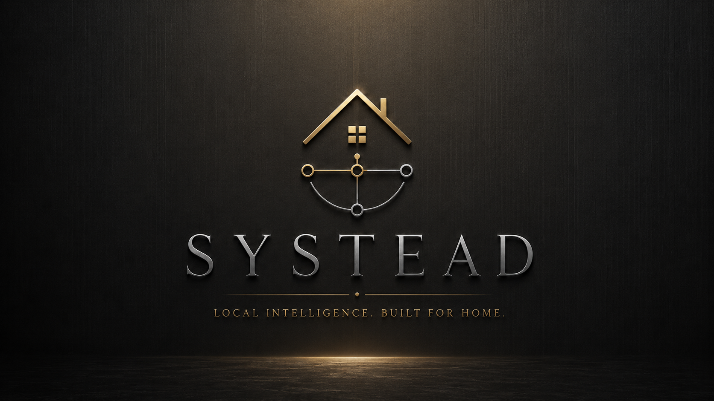

# Website service first

Working locally from the SD card? Double-click `START_PREVIEW.cmd` in this repository. See [CONTRIBUTING.md](CONTRIBUTING.md) for portable preview, editing, checks and manual Git upload.

Systead’s current commercial focus is bounded website design and build. Start with [the website service](https://systead.com/services.html) and [the estimate planner](https://systead.com/estimate.html). Software House and Programs remain early-stage. The following material describes that longer-term software direction.


<p align="center">
  <picture>
    <source srcset="assets/img/brand/systead-header.webp" type="image/webp">
    
  </picture>
</p>

<p align="center">
  <strong>Private continuity infrastructure for memory, decisions, responsibility, and long-lived work.</strong>
</p>

<p align="center">
  <a href="#the-first-60-seconds">60-second introduction</a> ·
  <a href="#why-systead-exists">Why it exists</a> ·
  <a href="#the-product-model">Product model</a> ·
  <a href="#programs">Programs</a> ·
  <a href="#vision">Vision</a> ·
  <a href="#current-status">Status</a> ·
  <a href="#documentation">Documentation</a>
</p>

---

> [!WARNING]
> **Systead software is a running private pre-alpha.** A private flagship House exists and is under real daily stress testing. There is no supported public installer, tester package, stable migration contract, production-security guarantee, support commitment, or release date yet.

> [!IMPORTANT]
> **AuthorMachine is an internal working name.** It identifies the private Stokknes House implementation lineage, which spans more than publishing. Folio is the working name for the reusable Publishing Program. The eventual release name, package, included features, pricing, licensing, and release identity remain undecided.

# The first 60 seconds

## What is Systead?

Systead is building the **House**: a private environment where knowledge, decisions, responsibilities, files, relationships, and specialist Programs can remain coherent over years.

The simplest distinction is:

> **Programs solve particular domains. Systead preserves the whole.**

Systead is the platform and broader product direction. A House is one operator's configured environment. Programs are optional specialist applications inside that House.

## Why does it need to exist?

Important work is spread across tools that do not share memory, authority, provenance, or history.

The task system knows what is due. The folder contains the file. The chat contains the reasoning. The specialist application understands one domain. The AI can generate or change material. The operator still has to remember how the whole situation fits together.

The operator has become the integration layer.

Systead is built around a different assumption:

> **The work should be able to remember itself.**

## Who is it for?

Systead is intended for people and small organisations whose work accumulates context and consequence over years:

- independent professionals;
- authors and publishers;
- researchers and consultants;
- creators managing complex bodies of work;
- founders and owner-operators;
- households carrying substantial administration;
- small organisations needing continuity without enterprise infrastructure.

It is especially relevant to someone who says:

- “My work no longer fits inside one app.”
- “I keep rebuilding context.”
- “I want AI assistance without surrendering authority.”
- “I need to know what is current and why.”
- “I care what happens to these records years from now.”

## What exists now?

A private flagship House is running under real daily workload. It is being stress-tested for persistence, indexing, record integrity, command safety, backup, restore, recovery, and hidden assumptions tied to one operator or publishing workflow.

The private whole-operation Stokknes House build has used **AuthorMachine** and **Stokknes OS** internally. Publishing is one domain within it. It is evidence that a working system exists. It is not a public release contract.

# The business, product and private House

Systead is the software and services venture. Stokknes House is the founder’s private whole-operation environment, where publishing, freelance work, household responsibilities and Systead business work can be coordinated. Stokknes Publishing House is a separate publishing operation within that wider private context.

The Publishing Program is reusable software, with Folio as its working name. The separately planned Web House website service is a commissioned deliverable, not a paid House Program. Its planner shows provisional pricing and produces a project brief, with no booking or checkout.

See [Systead and Stokknes](docs/public/SYSTEAD_AND_STOKKNES.md), [the House relationship](house.html#stokknes-house), and [the website-service direction](services.html).

# Why Systead exists

## The root problem: fragmentation

The problem is not that people lack software. The problem is that useful software usually stops at its own boundary.

- A note can preserve text without preserving its authority.
- A task can preserve an obligation without preserving the reason.
- A file can exist without anyone knowing whether it is current.
- A decision can survive while its evidence disappears.
- A calendar can know when something happens without knowing what it depends on.
- A chat can contain the explanation without becoming durable operational memory.
- An AI can act faster than the operator can inspect or recover.
- A specialist application can understand one domain and lose the rest of the House.

Systead aims to preserve continuity between those fragments.

## Problems the House should address

### Version and standing uncertainty

The correct record exists, but its current standing is unclear.

The House should distinguish current, working, historical, imported, derived, disputed, superseded, quarantined, and archived information.

### Decision amnesia

The outcome remains while the reasoning disappears.

A meaningful decision record should retain the problem, available options, evidence, rejected alternatives, constraints, expected consequences, responsible person, review date, resulting actions, and later outcome.

### Context collapse after interruption

After illness, overload, travel, changed work, or ordinary delay, the operator must reconstruct the situation from folders, messages, memory, and unfinished notes.

Systead should support a defining interaction:

> **Bring me back.**

Reconstruct where I was, what changed, what remains unresolved, what became blocked, and what I should read first.

### Unsafe intelligence and automation

AI can help compare, explain, classify, draft, and propose. It can also quietly misread, overwrite, publish, move, or delete.

Systead separates authority into observable stages rather than treating “intelligent” as permission.

### Tool accumulation

Every new tool may solve one problem while creating another account, database, data model, sync path, export format, and maintenance burden.

Systead does not need to replace every mature tool immediately. It needs to own the continuity layer those tools usually leave behind.

### Fragile digital estates

Years of work can become dependent on one service, one device, one undocumented script, one developer, or one person's memory.

A serious House should be designed to survive changing tools, changing AI models, failed devices, removed Programs, and eventually Systead itself being replaced.

# The defining experiences

Five interactions should explain Systead better than fifty feature cards.

## Bring me back

> “I have not touched this project in six weeks. Reconstruct where I was, what changed, what remains unresolved, and what I should read first.”

## Why is this true?

> “Show the source, decision history, uncertainty, contradictions, and most recent verification.”

## What changes if I do this?

> “Show every affected record, commitment, file, Program, destination, and automation before approval.”

## Resolve this safely

> “Preserve the current state, show the correction plan, execute only what was approved, verify the result, and retain recovery.”

## What needs me?

> “Surface blocked responsibilities, expiring commitments, unresolved conflicts, and decisions that require human judgment.”

# The product model

```text
Systead
├── Core / Trust Kernel
│   ├── identity and authority
│   ├── canonical records and provenance
│   ├── decisions and evidence
│   ├── commands and approval
│   ├── privacy and boundary controls
│   ├── audit, verification, and recovery
│   └── export and portability contracts
├── House
│   ├── calm starting surfaces
│   ├── Rooms and Desks
│   ├── operator-owned records and configuration
│   ├── selected Programs and utilities
│   └── declared Connectors
├── House Steward
│   ├── observe
│   ├── explain
│   ├── detect
│   ├── reconstruct
│   ├── propose
│   ├── stage
│   └── verify approved actions
├── Programs
│   └── Program 01: Publishing
├── Connectors
└── Exit Kit
```

## Systead

The platform, ecosystem, brand, and broader future-company direction.

Systead defines the shared rules for memory, authority, evidence, safety, recovery, Programs, connectors, and exit.

## Core and Trust Kernel

The non-negotiable foundation:

- identity and permissions;
- canonical standing and provenance;
- decisions and evidence;
- authority and command review;
- privacy boundaries;
- audit and verification;
- recovery and portability.

## A House

One operator's configured private environment.

The House is what the operator experiences. It can contain Today, active work, selected Rooms, Desks, records, knowledge, relationships, practical responsibilities, Programs, and declared connectors.

A House can remain small. It must not require every possible Room or Program.

## Rooms

Broad areas of responsibility inside the House, such as Work, Knowledge, Household, Contacts, or Administration.

## Desks

Focused operational surfaces inside Rooms.

## House Steward

The working name for the intelligence and controlled-action layer.

The Steward should behave less like an unbounded chatbot and more like an inspectable private steward that can always show its evidence, authority, scope, and result.

## Programs

Optional specialist applications inside the House.

Programs can be deep and opinionated. They cannot own the person's general memory, bypass Core safety, silently access unrelated Rooms, or trap the House in undocumented structures.

Core rule:

> **Programs are replaceable. The House is durable. No Program owns the person.**

## Connectors

Declared access to outside tools, services, models, destinations, and synchronization paths.

A connector must not become invisible authority.

## Exit Kit

Human-readable and machine-readable export, manifests, checksums, restore tools, migration documentation, and ordinary-file fallbacks where possible.

# What a House should feel like

The private flagship is dense because it carries accumulated real-world complexity. Public Systead needs progressive disclosure.

## Depth 1: Calm starting surface

A new operator should initially see:

- what changed;
- what matters today;
- active work;
- something waiting for review;
- quick capture;
- search;
- selected areas.

## Depth 2: Working Rooms

Inside a Room, the House may reveal:

- records;
- relationships;
- timelines;
- source material;
- decisions;
- state and dependencies;
- next actions;
- relevant tools.

## Depth 3: Machinery underneath

Advanced surfaces may expose:

- provenance;
- canonical ownership;
- conflicts;
- schemas;
- commands;
- authority;
- automation rules;
- audit;
- recovery;
- indexing;
- system health.

Nothing useful needs to be removed. It needs to be layered.

# Who Systead is for

## High-fit audiences

### Independent professionals and owner-operators

People who personally carry client context, decisions, obligations, files, history, and operational continuity.

### Creators with long-lived bodies of work

Authors, publishers, designers, researchers, and other creators managing versions, rights, releases, evidence, relationships, and correction history.

### Complex households

Homes carrying assets, documents, services, maintenance, recurring administration, and shared practical memory.

### Small owner-operated organisations

Small groups that need continuity and controlled sharing without enterprise bureaucracy or a surveillance-first data model.

## Not currently for

Systead is not currently positioned as:

- a casual notes app;
- a social workspace;
- a mature large-team collaboration platform;
- an enterprise ERP replacement;
- a fully autonomous AI operator;
- a supported hosted cloud service;
- a public production release.

# Differentiation

Systead should not try to win by claiming more checkboxes than existing tools.

Its intended advantage is the combination of:

- canonical memory;
- decision continuity;
- provenance and uncertainty;
- consequence-aware controlled action;
- cross-Program continuity;
- time-aware reconstruction;
- operator authority;
- recovery and exit.

| Existing category | Usually provides | Systead should add |
|---|---|---|
| Notes and knowledge tools | Information and links | Current standing, provenance, contradiction, responsibility, and continuity |
| Project management | Tasks, status, and deadlines | Decision history, evidence, dependency, and cross-domain consequence |
| AI assistants | Answers and generated work | Governed context, authority limits, verification, and recovery |
| Specialist software | Depth in one domain | Cooperation with the rest of the House |
| Dashboards | A snapshot of state | Why the state exists, what changed, and what requires judgment |
| Custom scripts | Tailored automation | Inspectable power without permanent maintenance chaos |
| Cloud workspaces | Convenience and collaboration | Local control, durable export, and reduced platform dependence |

The strongest short distinction is:

> **Other tools help create or organise information. Systead helps the work remain coherent over time.**

# Programs

Programs are only one layer of Systead.

They add specialist records, workflows, interfaces, tools, imports, exports, and scoped intelligence. They inherit shared Core contracts instead of rebuilding authority, privacy, audit, recovery, and portability independently.

## Program 01: Publishing

The first specialist Program serves authors and publishing operations.

Its current Program working name is **Folio**. AuthorMachine refers to the broader private implementation lineage.

The name identifies the private v10 line and current development discussions. It is not locked as the public release name.

Publishing is a strong proving domain because it includes:

- long-lived projects;
- many file versions;
- canon and continuity;
- research and decisions;
- rights and contracts;
- editions and formats;
- production stages;
- contacts and outreach;
- public releases;
- post-release corrections.

Current private-build direction includes or explores:

- project and book cockpits;
- manuscript and revision state;
- canon, continuity, characters, locations, timelines, and rules;
- contradiction, plot-hole, proofing, and decision registers;
- edition-specific production;
- metadata, pricing, rights, and catalogue;
- ARC, reviewer, contact, and release operations;
- source-aware assistance;
- controlled exports and destinations.

This is a direction map, not a final release checklist.

The final public name, package boundaries, included features, pricing, licence, supported platforms, and release identity remain undecided.

## Future Programs

The architecture should allow additional specialist Programs. Possible domains may be discussed to test whether the platform model generalises.

Such examples are not announced products until formally named, scoped, approved, and added to the roadmap.

# House Steward and controlled intelligence

House Steward should follow an authority ladder.

## 1. Observe

Read within declared scope without changing state.

## 2. Explain

Show evidence, assumptions, uncertainty, and conflict.

## 3. Propose

Recommend a bounded change and explain why.

## 4. Stage

Prepare the exact operation, affected records, destinations, verification, and recovery path.

## 5. Execute

Perform only the operation permitted at the approved authority level.

## 6. Verify

Check the result, report partial failure, preserve evidence, and retain recovery.

The existence of intelligence does not create permission.

# Canonical memory and decision continuity

## Canonical standing

For meaningful information, the House should be able to answer:

- Is this current?
- What source supports it?
- What replaced the previous version?
- Does another record disagree?
- Who or what depends on it?
- When was it last reviewed?
- Is it fact, interpretation, estimate, inference, or unresolved claim?

## Decision continuity

A Decision Ledger should reconstruct why a choice made sense at the time, not merely list the outcome.

A decision may retain:

- problem;
- options;
- evidence;
- rejected alternatives;
- constraints;
- expected consequences;
- responsible operator;
- review date;
- resulting actions;
- later outcome.

# Consequence-aware action

Before material change, Systead should be able to show:

1. intended change;
2. supporting evidence;
3. affected records;
4. likely consequences;
5. external destinations;
6. required authority;
7. verification method;
8. reversibility or recovery path.

A generic “Are you sure?” dialog is not enough for serious work.

# Time-aware reconstruction

A mature House should support questions such as:

- What did the House consider current on this date?
- What changed since I last worked here?
- Which decisions were still open?
- When did these records begin contradicting each other?
- Which file was canonical before the current edition?
- What happened immediately before this project stalled?

This is not merely version history. It is continuity across time.

# Portability and exit

Systead should be designed as though the application may disappear.

A complete House export should aim to be:

- human-readable;
- machine-readable;
- documented;
- checksummed;
- internally linked;
- understandable without running Systead;
- restorable into a clean installation;
- usable as ordinary files where possible.

The promise is not that every specialist capability can be reproduced without Systead. The promise is that the operator's important records and relationships should not become unintelligible hostages.

# Vision

## Working company-level vision

> **Every serious person should be able to build institutional memory without having to become an institution.**

At full maturity, Systead could become private continuity infrastructure for an individual, household, independent professional, or owner-operated organisation.

Not merely productivity software, but a combination of:

- memory infrastructure;
- decision infrastructure;
- operational control;
- private intelligence;
- continuity planning;
- durable digital estate;
- specialist Programs that cooperate without owning the person.

## Vision horizons

### Horizon 1: Private proving ground

Prove one complex House can remain useful, coherent, inspectable, recoverable, and extensible under real pressure.

### Horizon 2: Calm public foundation

Allow another operator to install Systead, understand the House, import real work, use a Program, recover from failure, and leave with their information intact.

### Horizon 3: Broader personal House

Support several long-lived domains without collapsing into an everything-dashboard.

### Horizon 4: Household and owner-operated organisation

Introduce controlled sharing, roles, and continuity without weakening ownership or boundaries.

### Horizon 5: Durable ecosystem

Support Programs, Connectors, migration, private deployment, and long-term continuity around stable Core contracts.

These are direction horizons, not dates or release promises.

## Product discipline

The risk is obvious: Systead could become a beautiful digital mansion with two hundred rooms that nobody understands how to enter.

The answer is not to reduce the ambition. It is to contain it through architecture, progressive disclosure, and release boundaries.

> **Five useful surfaces first. Depth when requested. Machinery when necessary.**

# Systead principles

1. The operator owns the House.
2. No destructive action happens silently.
3. Important conclusions expose their evidence.
4. Uncertainty is represented rather than hidden.
5. Canonical records remain challengeable and traceable.
6. Programs cannot bypass Core safety.
7. Private information does not cross boundaries accidentally.
8. Automation remains inspectable and interruptible.
9. The House remains exportable and recoverable.
10. AI assists judgment; it does not impersonate certainty.
11. Public claims remain narrower than private ambition.

# Current status

**Status date:** 19 July 2026
**Development label:** Running private pre-alpha
**Public testing:** Closed

## What exists

- a running private flagship House;
- broader House and command-centre surfaces;
- local records and operational data;
- searchable source material;
- decisions and review queues;
- command and safety concepts;
- backup, recovery, audit, and portability foundations;
- shared Rooms, Desks, and modules;
- Program 01: Publishing;
- synthetic focus contracts for Program 02: Shared Home and Program 03: Property Steward;
- a public repository and documentation layer;
- a public product site.

## What is happening now

- real-workload stress testing;
- startup and persistence testing;
- duplicate, contradiction, and canonical-standing review;
- private v10 characterization;
- Core, House, and Program separation;
- recovery and export hardening;
- synthetic fixture creation;
- public product and architecture documentation.

## What does not exist yet

- supported public installer;
- stable outside-user migration and upgrade path;
- stable public API or schema contract;
- production-grade security guarantee;
- completed independent security review;
- mature collaboration;
- complete accessibility validation;
- support response commitment;
- final Program 01 name;
- final feature contract;
- announced release date.

# Bringing the private v10 build into Systead

The private v10 build should not be copied directly into public `main`.

Required intake path:

```text
Untouched private snapshot
        ↓
Private intake workspace
        ↓
Secret and privacy scan
        ↓
Behaviour characterization
        ↓
Core / House / Program classification
        ↓
Synthetic fixtures and tests
        ↓
Reviewed extraction commits
        ↓
Public repository
```

The private build must be treated as:

- evidence of working behaviour;
- a source of architecture and requirements;
- a stress-test environment;
- a private customer configuration;
- a source of accidental assumptions that must be identified.

It must not be treated as a clean public product tree merely because it runs.

Read:

- [`Application/docs/canonical/PRIVATE_V10_INTAKE.md`](Application/docs/canonical/PRIVATE_V10_INTAKE.md)
- [`Application/docs/canonical/V10_HANDOFF_BRIEF.md`](Application/docs/canonical/V10_HANDOFF_BRIEF.md)
- [`Application/docs/canonical/PROGRAM_01_PUBLISHING.md`](Application/docs/canonical/PROGRAM_01_PUBLISHING.md)

# Repository map

```text
/
├── README.md
├── index.html
├── why.html
├── house.html
├── programs.html
├── vision.html
├── principles.html
├── assets/
│   ├── css/
│   └── img/
├── docs/
│   └── public/
├── profile/
└── Application/
    ├── docs/
    │   └── canonical/
    └── programs/
        └── publishing/
```

The repository remains transitional. Root public presentation, canonical documentation, private v10 intake, and implementation extraction must not be confused with one another.

# Documentation

## Public orientation

- [Why Systead](docs/public/WHY_SYSTEAD.md)
- [The House](docs/public/THE_HOUSE.md)
- [Programs](docs/public/PROGRAMS.md)
- [Vision](docs/public/VISION.md)
- [Principles](docs/public/PRINCIPLES.md)
- [Who it is for](docs/public/WHO_IT_IS_FOR.md)
- [Status and scope](docs/public/STATUS_AND_SCOPE.md)

## Canonical product direction

- [Canonical documentation index](Application/docs/canonical/README.md)
- [Company and platform vision](Application/docs/canonical/COMPANY_VISION.md)
- [Problems and use cases](Application/docs/canonical/PROBLEMS_AND_USE_CASES.md)
- [Audience and fit](Application/docs/canonical/AUDIENCE_AND_FIT.md)
- [Product north star](Application/docs/canonical/PRODUCT_NORTH_STAR.md)
- [Product model](Application/docs/canonical/PRODUCT_MODEL.md)
- [Platform versus Programs](Application/docs/canonical/PLATFORM_VS_PROGRAMS.md)
- [Differentiation](Application/docs/canonical/DIFFERENTIATION.md)
- [Systead constitution](Application/docs/canonical/SYSTEAD_CONSTITUTION.md)
- [House Steward](Application/docs/canonical/HOUSE_STEWARD.md)
- [Program 01](Application/docs/canonical/PROGRAM_01_PUBLISHING.md)
- [Current status](Application/docs/canonical/STATUS.md)
- [Roadmap](Application/docs/canonical/ROADMAP.md)

## Private v10 and release discipline

- [Private v10 intake](Application/docs/canonical/PRIVATE_V10_INTAKE.md)
- [V10 handoff brief](Application/docs/canonical/V10_HANDOFF_BRIEF.md)
- [Stress-test protocol](Application/docs/canonical/STRESS_TEST_PROTOCOL.md)
- [Release readiness](Application/docs/canonical/RELEASE_READINESS.md)
- [Public/private boundaries](Application/docs/canonical/PUBLIC_PRIVATE_BOUNDARIES.md)

# Brand, ownership, and working names

Systead is the product and brand name.

Current copyright remains:

> **© 2026 Marius Johan Stokknes.**

The intended future company direction is Systead Systems, subject to actual formation, legal review, written IP arrangements, and later decisions.

Stokknes Publishing is a separate publishing direction and proving customer. It should not accidentally become the owner or definition of the general Systead platform.

AuthorMachine remains an internal working name until a release identity is deliberately selected and cleared.

# Final orientation

Systead is not being built as a larger productivity dashboard or a writing application that may later grow sideways.

It is being built as the House: private continuity infrastructure where knowledge, decisions, responsibility, files, relationships, and specialist Programs can remain coherent over years.

Publishing is the first evidence that one Program can become deep.

It is only one Program.

> **The platform is Systead. The lived environment is the House. Programs provide specialist depth. The operator remains the authority.**

## Website languages

The top-right flag selector supports English, Norwegian Bokmål and Spanish. It remembers the choice on this device and carries `?lang=en`, `?lang=nb` or `?lang=es` through website links. Prices remain in EUR. Language changes preserve calculator selections, supplier amounts and custom project labels. The project brief uses the selected language.

Edit website translations in `assets/i18n/messages.js`, keyed by the original English text. When changing English copy, update the matching keys and both translations. Technical repository documents and the private House interface are outside this visitor-language switch. No external translation service is called.
