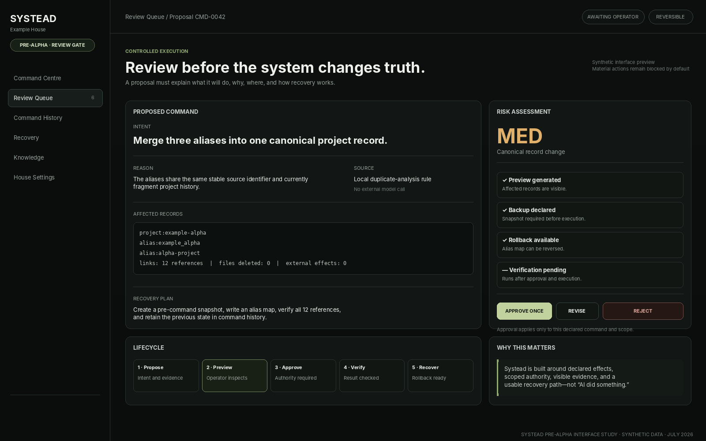
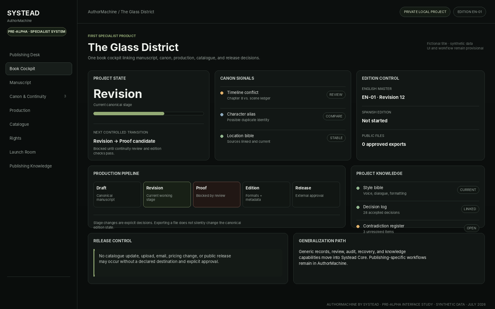

# Systead

**Local-first command systems for running work, knowledge, records, review, automation, and specialist workflows under human control.**

> **Current status — 19 July 2026:** Systead is a **running private pre-alpha** in its **first week of stress testing**. The build exists and is being used under real daily workload, but there is no public tester package, supported installer, production-security claim, stable API, or announced release date.

[Website](https://systead.com) · [Canonical documentation](Application/docs/canonical/README.md) · [Public pre-alpha walkthrough](docs/public/PRE_ALPHA_WALKTHROUGH.md) · [Current status](Application/docs/canonical/STATUS.md)

## What Systead is

Systead is the parent platform and operating architecture for a configurable, operator-owned environment called a **House**.

A House connects the records, projects, knowledge, decisions, review queues, commands, history, backups, recovery paths, and specialist systems required to run ongoing work. The point is not to place more widgets on one screen. The point is to prevent important work from becoming scattered across disconnected apps, duplicate records, unexplained automation, and files whose authority is unclear.

Systead is being built around five practical questions:

1. **What is the current canonical truth?**
2. **What changed, and what evidence supports it?**
3. **What action is being proposed, and what will it affect?**
4. **Who has authority to approve it?**
5. **How is the result verified, audited, and recovered if it fails?**

## Canonical product model

| Layer | Meaning |
|---|---|
| **Systead** | The parent brand, platform, and universal operating architecture. |
| **Systead Core** | Generic records, storage, knowledge, commands, review, safety, audit, integrations, export, backup, and recovery. |
| **House** | One operator’s configured Systead environment: data, terminology, selected modules, workflows, permissions, and optional integrations. |
| **Specialist systems** | Purpose-built products that use Core contracts while adding domain-specific records and workflows. |
| **AuthorMachine by Systead** | The first specialist product, focused on publishing operations. |
| **Stokknes House** | The private flagship and proving ground. Reusable architecture may be extracted; its personal records and configuration are never distributed as demo data. |

“**Systead House**” may be used descriptively, but **House** is the environment model—not a second parent product competing with Systead.

## Pre-alpha interface views

These are **public-safe interface studies** based on the current private build and product architecture. They use synthetic data and are not release screenshots. They show the intended operating model without exposing private House records, manuscripts, contacts, finances, credentials, analytics, or stress-test telemetry.

### House Command Centre

[](assets/img/pre-alpha/house-command-centre.png)

The Command Centre is intended to answer: what changed, what needs judgment, what is blocked, what is safe, and what can wait. It is not meant to hide complexity behind a single “everything is fine” score.

### Command Review Gate

[](assets/img/pre-alpha/command-review.png)

Material actions remain proposals until their intent, source, reason, scope, affected records, risk, confirmation requirement, verification step, and recovery route are visible.

### AuthorMachine Book Cockpit

[](assets/img/pre-alpha/authormachine-cockpit.png)

AuthorMachine links manuscript state, canon, continuity, project decisions, editions, production, catalogue, rights, launch operations, and approved external actions without turning publishing-specific assumptions into the universal platform.

See [Pre-alpha interface notes](docs/public/SCREENSHOTS.md) for the exact public claim these images are allowed to make.

## Operating principles

- **Local-first by default.** Essential records and workflows should remain useful without a mandatory cloud account.
- **Operator ownership.** The operator owns the records, configuration, exports, and final decisions.
- **AI proposes; humans approve.** AI may analyze, compare, classify, summarize, draft, detect conflicts, or prepare commands. It does not silently turn uncertain output into canonical truth.
- **Explainability before confidence theatre.** A proposal should expose sources, assumptions, uncertainty, affected records, and consequences.
- **Canonical truth over cloned convenience.** Modules link stable records instead of quietly creating drifting copies.
- **External effects are deliberate.** Publishing, sending, payment, synchronization, deletion, and account changes require explicit destinations and suitable approval.
- **Reversibility is architectural.** Backup, history, verification, rollback, quarantine, restore, and corrective action are product behavior—not emergency additions.
- **Privacy boundaries are explicit.** Access to private material does not imply permission to place it in a repository, public page, model prompt, email, export, or analytics service.
- **Portability is part of trust.** A House must be inspectable and exportable in documented formats.

Read the full [Operating Principles](Application/docs/canonical/OPERATING_PRINCIPLES.md).

## Command safety model

Material actions should move through a visible lifecycle:

1. **Propose** — declare the intended change, source, reason, assumptions, and confidence.
2. **Preview** — show affected records, files, destinations, integrations, and likely consequences.
3. **Approve** — obtain the required human authority for the exact scope and risk.
4. **Execute** — perform only the operation that was previewed and approved.
5. **Verify** — check the expected result and report mismatch or partial failure.
6. **Audit** — record what changed, when, why, from which source, and under whose authority.
7. **Recover** — rollback, restore, quarantine, or perform a documented corrective action.

The aim is not to eliminate automation. It is to make automation legible, scoped, and recoverable.

## AuthorMachine by Systead

AuthorMachine is the first specialist product and the main architecture-discovery domain.

Its intended scope includes:

- book and project cockpits;
- manuscript and edition control;
- canon, continuity, timelines, locations, characters, and style bibles;
- decision logs, contradiction registers, plot-hole review, and proofing issues;
- production pipelines by edition and format;
- catalogue, rights, pricing, metadata, and release state;
- launch rooms, ARC workflows, reviewers, publishing contacts, and outreach history;
- approved exports and synchronization to declared external destinations;
- publishing knowledge with evidence and source visibility;
- reviewable AI assistance.

Generic capabilities discovered through AuthorMachine must move into Systead Core when they apply beyond publishing. Publishing-specific assumptions remain inside AuthorMachine.

## Honest pre-alpha status

The current label is **pre-alpha**, not “alpha foundation in preparation” and not “ready for testing.”

| Area | Current status |
|---|---|
| Running build | A private build is operating in the flagship proving environment. |
| Real use | It is being used under normal daily workload rather than only static demo flows. |
| Stress test | Week one is focused on failures, confusing states, data boundaries, migrations, duplicate truth, recovery, and unsafe shortcuts. |
| Public testing | Closed. No supported tester build, installer, onboarding, or compatibility promise. |
| Security | No production-grade security claim, formal audit, or complete threat-model claim. |
| Public data | Synthetic or deliberately sanitized only. Private House records are not public fixtures. |
| Licensing | No blanket public software licence unless a component explicitly states otherwise. |
| Release date | Not announced. Readiness gates take priority over an invented date. |

Read [Status](Application/docs/canonical/STATUS.md), [Pre-alpha Program](Application/docs/canonical/PRE_ALPHA_PROGRAM.md), and [Stress-test Protocol](Application/docs/canonical/STRESS_TEST_PROTOCOL.md).

## What the first stress-test phase is trying to break

The current phase deliberately looks for:

- modules that create duplicate or contradictory truth;
- records that cannot explain their source or authority;
- commands whose side effects or recovery path are unclear;
- imports that lose provenance or cross private/public boundaries;
- partial failures that leave the operator unsure what changed;
- fragile schema migrations and restoration gaps;
- external integrations that can act without a declared destination;
- publishing-specific assumptions leaking into Core;
- private Stokknes configuration leaking into reusable defaults;
- interfaces that display information but do not support a safe next decision.

This is failure discovery, not performance theatre. No public reliability metric will be claimed until the measurement method and workload are documented.

## Repository state

The repository is transitional:

```text
/
├── index.html                     Public pre-alpha website
├── assets/                        Public visual and website assets
├── profile/                       Organization-profile source material
├── docs/public/                   Public walkthroughs, FAQ, and image notes
└── Application/                   Authoritative implementation bootstrap
    ├── apps/                      User-facing application shells
    ├── packages/                  Generic platform packages
    ├── modules/                   Optional and specialist modules
    ├── config/                    Local and synthetic configuration templates
    ├── docs/canonical/            Product, architecture, safety, status, and boundary truth
    ├── scripts/                   Validation and local bootstrap helpers
    ├── tests/                     Automated and acceptance-test scaffolding
    ├── releases/                  Future release manifests and packages
    └── archive/                   Retired material not loaded by the product
```

Until a deliberate flattening or split occurs, `Application/` is the authoritative implementation bootstrap. The repository root is the public presentation and navigation layer.

Read [Repository Structure](Application/docs/canonical/REPOSITORY_STRUCTURE.md).

## Start here

1. [Product Model](Application/docs/canonical/PRODUCT_MODEL.md)
2. [Operating Principles](Application/docs/canonical/OPERATING_PRINCIPLES.md)
3. [System Architecture](Application/docs/canonical/SYSTEM_ARCHITECTURE.md)
4. [Public and Private Boundaries](Application/docs/canonical/PUBLIC_PRIVATE_BOUNDARIES.md)
5. [Pre-alpha Program](Application/docs/canonical/PRE_ALPHA_PROGRAM.md)
6. [Stress-test Protocol](Application/docs/canonical/STRESS_TEST_PROTOCOL.md)
7. [Roadmap](Application/docs/canonical/ROADMAP.md)
8. [Decision Register](Application/docs/canonical/DECISION_REGISTER.md)

## What this repository does not claim

This repository does not currently claim:

- production readiness;
- completed security hardening;
- stable public APIs or data schemas;
- a public installer or supported upgrade path;
- multi-user or enterprise isolation guarantees;
- legal, accounting, medical, or compliance automation accuracy;
- autonomous authority over publishing, payments, communication, deletion, or account changes;
- final pricing, licensing, support, or release dates.

## Public and private boundaries

Public material may contain architecture, generic schemas, synthetic examples, sanitized interface studies, public brand material, and non-sensitive test fixtures.

It must not contain private House data, real contacts, credentials, manuscripts, financial records, medical or legal records, personal communications, private analytics, access tokens, identifying operational history, or any source that has not been deliberately approved for publication.

See [Public and Private Boundaries](Application/docs/canonical/PUBLIC_PRIVATE_BOUNDARIES.md).

## Website and organization

- Website: [systead.com](https://systead.com)
- GitHub organization: [github.com/Systead](https://github.com/Systead)

Copyright © 2026 Marius Johan Stokknes.

No public software licence has been granted unless a specific file or component explicitly states otherwise.
