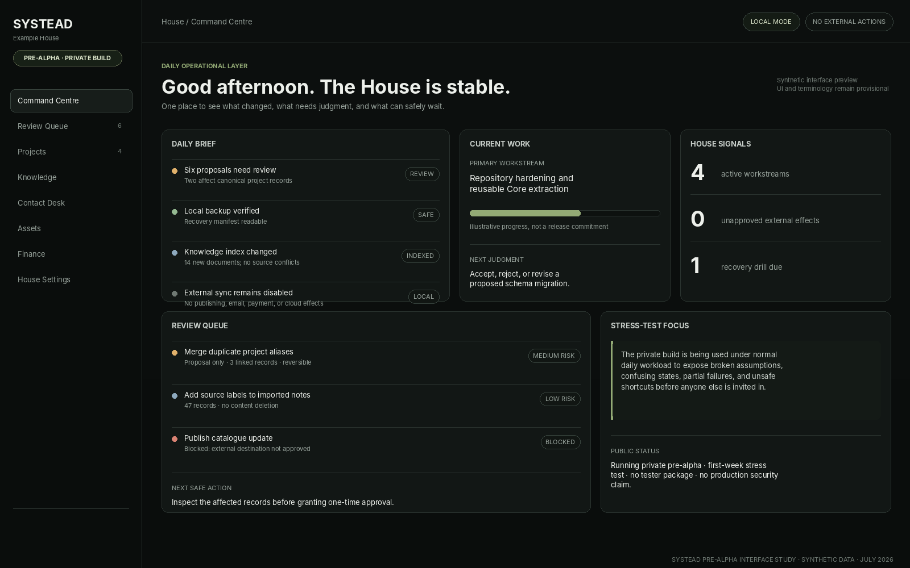

# Systead

**Local-first command systems. Operator-owned, explainable, and reversible.**

Systead is building a configurable operating environment called a **House**—one place to connect records, projects, knowledge, review, automation, and specialist systems without quietly surrendering control of data or decisions.

> **Current status:** A private pre-alpha build is running in its first week of stress testing. Public testing is not open yet.

## Product architecture

- **Systead** — the parent platform and universal architecture.
- **Systead Core** — generic records, knowledge, commands, review, safety, audit, integrations, export, backup, and recovery.
- **House** — one operator’s configured Systead environment.
- **AuthorMachine by Systead** — the first specialist product, focused on publishing operations.
- **Stokknes House** — the private flagship and proving ground; never distributed as public demo data.

## Principles

- Local-first by default.
- The operator owns the data and final decision.
- AI proposes; humans approve.
- Important actions are visible, scoped, logged, verified, and recoverable.
- Private data is not silently turned into public output.
- Modules link canonical records rather than cloning truth.
- No forced cloud, telemetry, publishing, payment, deletion, or external communication.

## Pre-alpha reality

The build exists and is being used privately under real daily workload. The current phase is deliberately trying to expose broken assumptions, confusing states, fragile migrations, duplicate truth, recovery gaps, and unsafe shortcuts before a tester package is offered.

There is currently no supported installer, stable API, production-security claim, or announced release date.

**Website:** [systead.com](https://systead.com)
**Repository:** [github.com/Systead/systead](https://github.com/Systead/systead)
